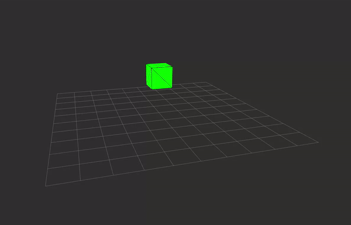
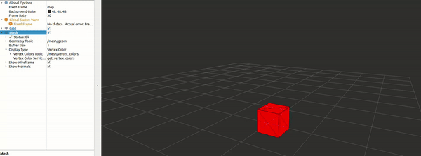

# mesh_msgs_examples

Some examples showing how the mesh_msgs of [mesh_tools](https://github.com/naturerobots/mesh_tools) work.


## Create and publish a cube

File: `src/publish_mesh_geometry.cpp`


1. Start Node: 

```bash
ros2 run mesh_msgs_examples publish_mesh_geometry
```

2. Open RViz

```bash
rviz2
```

3. Add Mesh display: "Add" -> "By Display Type" -> "Mesh"
4. Display the `/mesh` topic
5. Result:



Troubleshooting:
- Make sure the fixed frame is set to "map"


## Create and publish mesh geometry and vertex colors

File: `src/publish_mesh_with_vertex_colors.cpp`

